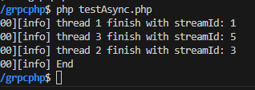
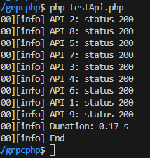
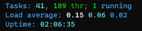

## About
gRPC framework written in PHP with Openswoole extension to support concurrency, multihreading, HTTP/2 and event driven capabilities in modern PHP development. 

## Reference
- [GRPC Website](https://grpc.io/)
- [Open Swoole Website](https://openswoole.com/docs)
- [Open Swoole Github](https://github.com/openswoole)
- [Benchmark](https://medium.com/@rioastamal/benchmark-php-swoole-vs-nodejs-vs-go-539a5493b067)

## Prerequisites
- Composer 2.0 +
- PHP 8.1 +
- Ubuntu 20.04.4 LTS (Focal Fossa)
- PHP Extension Installed: "openswoole.so", 

## Refer either examples for PHP extension installation:
- https://openswoole.com/docs/get-started/installation
- https://github.com/openswoole/ext-openswoole/tree/22.x (recommended)

## Tested on
- Composer 2.0.7
- PHP 8.1.27
- Ubuntu 20.04.4 LTS (Focal Fossa)

## Get Started (Create http server connection):
1. configure env HOST and PORT
2. cmd: composer install
3. cmd: php index.php
4. browse {hostname}:{port}/{path} (eg: localhost:9501/test)

After established server, open new terminal and test run with commands bellow

## Test asynchronous with client pooling:
1. cmd: php testAsync.php
- Test Result:
    - 

## Test asynchronous with REST API:
1. cmd: php testApi.php
- Test Result:
    - 
    - 
- Remarks:
    - Test compared with NodeJs, performance are mostly tied with 100 requests/s.
    - When scale to 1000 requests, sometimes will prompt limitation. Issue related with https://stackoverflow.com/questions/65773964/php-swoole-error-accept-failed-error-too-many-open-files24. Seems like some configuration is missing.
    - Note that openswoole is using virtual multi-threading to achieve concurrency and unlike nodejs which used single threaded event loop to achieve asynchronous result.